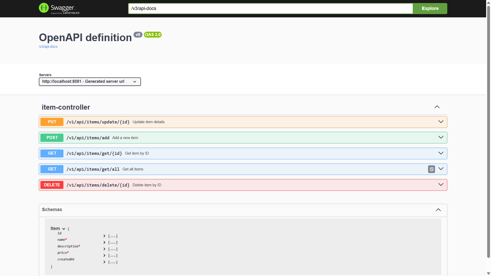

# ✅ E-Commerce Item Management REST API
This project is a Spring Boot-based RESTful backend application that provides APIs to manage items in an e-commerce-like system.
The application allows users or client applications to perform CRUD operations (Create, Read, Update, Delete) on items through REST APIs.
The project is designed to demonstrate backend development skills, API design, validation, and exception handling without using an external database by utilizing in-memory storage.

# What the Application Does
## 📦 The application manages item data, where each item contains:


# 🚀 Key Features Implemented

<details>
<summary><b>1️⃣ RESTful API Design</b></summary>

APIs follow REST principles using HTTP methods:

| Operation | Method |
|------------|--------|
| Create item | POST |
| Fetch item | GET |
| Update item | PUT |
| Delete item | DELETE |

</details>

---

<details>
<summary><b>2️⃣ In-Memory Storage</b></summary>

Items are stored using:

```java
ArrayList<Item>
```

instead of a database.

This keeps the project simple and fast for demonstration purposes.

⚠ Data resets when application restarts.

</details>

---

<details>
<summary><b>3️⃣ Input Validation</b></summary>

User inputs are validated using annotations:

- Item name is required
- Description is required
- Price must be positive
- Invalid data returns structured error responses

</details>

---

<details>
<summary><b>4️⃣ Exception Handling</b></summary>

Global exception handling ensures:

- Item not found errors handled
- Validation errors returned properly
- Clean error responses sent to client

</details>

---

<details>
<summary><b>5️⃣ Service Layer Architecture</b></summary>

The project uses:

- Interface + Implementation pattern
- Separation of business logic from controllers

This improves scalability and maintainability.

</details>


## 6. Swagger API Documentation

### Swagger UI automatically documents APIs and allows testing APIs directly from browser.

<p align="center">
  
</p>

## 7. Clean Project Structure

```
e-commerce
│
├── src/main/java/com.omps.e_commerce
│   ├── controller
│   │    └── ItemController
│   │
│   ├── exception
│   │    ├── GlobalExceptionHandler
│   │    └── ItemNotFoundException
│   │
│   ├── model
│   │    ├── Item
│   │    └── CustomInfoError
│   │
│   ├── repository
│   │    └── ItemRepository
│   │
│   ├── service
│   │    ├── ItemService
│   │    └── ItemServiceImpl
│   │
│   └── ECommerceApplication
│
└── resources
    └── application.properties
```

## 📥 How to Download & Run the Application

Follow the steps below to run the project locally.

---

### ✅ 1. Install Java Development Kit (JDK 21)

Download and install **Java JDK 21** from the official Oracle website:

https://www.oracle.com/java/technologies/javase/jdk21-archive-downloads.html

After installation, verify Java installation:

```bash
java -version
```

---

### ✅ 2. Install an IDE

You can use any Java IDE. Recommended options:

**IntelliJ IDEA**  
https://www.jetbrains.com/idea/download/?section=windows

OR

**Spring Tool Suite (STS)**  
https://spring.io/tools#eclipse

---

### ✅ 3. Clone the Repository

If Git is not installed on your system, download and install it first:

https://git-scm.com/downloads

After installation, verify Git is available:

```bash
git --version
```

Clone the project from GitHub:

```bash
git clone https://github.com/omprakashsao/E-Commerce-CRUD-PROJECT.git
```

Move into the project directory:

```bash
cd E-Commerce-CRUD-PROJECT
```

---

### ✅ 4. Run the Project

Run using one of the following methods:

**Option A — IDE**
Open the project in your IDE and run:

```
ECommerceApplication.java
```

**Option B — Maven Command**
```bash
mvn spring-boot:run
```

---

### ✅ 5. Application Base URL

Once running, application will be available at:

```
http://localhost:8081
```

Base API path:

```
http://localhost:8081/v1/api/items
```

---

## 📌 API Endpoints

| Method | Endpoint | Description |
|---------|---------|------------|
| POST | `/add` | Add new item |
| GET | `/get/{id}` | Get item by ID |
| GET | `/get/all` | Get all items |
| PUT | `/update/{id}` | Update item |
| DELETE | `/delete/{id}` | Delete item |

---

## 📌 API Endpoints and Usage

Base URL:

```
http://localhost:8081/v1/api/items
```

Below are the available API operations.

---

### ➕ Add Item

**Endpoint**
```
POST /add
```

**Description**
Creates a new item and stores it in memory.

**Request Body Example**
```json
{
  "name": "Laptop",
  "description": "Gaming Laptop",
  "price": 75000
}
```

**Response**
Returns saved item with generated ID and timestamp.

---

### 📖 Get Item by ID

**Endpoint**
```
GET /get/{id}
```

**Description**
Fetches item details using its unique ID.

**Example**
```
GET /get/1
```

**Response**
Returns item if found, otherwise returns 404 error.

---

### 📚 Get All Items

**Endpoint**
```
GET /get/all
```

**Description**
Returns list of all stored items.

**Response**
List of items currently stored in memory.

---

### 📝 Update Item

**Endpoint**
```
PUT /update/{id}
```

**Description**
Updates an existing item.

**Example**
```
PUT /update/1
```

**Request Body**
```json
{
  "name": "Updated Laptop",
  "description": "Updated description",
  "price": 80000
}
```

**Response**
Returns updated item.

---

### 🗑 Delete Item

**Endpoint**
```
DELETE /delete/{id}
```

**Description**
Deletes an item using its ID.

**Example**
```
DELETE /delete/1
```

**Response**
Returns success message if deleted.

---

## ⚙ Important Implementation Details

### 1. In-Memory Storage
Items are stored using:

```java
ArrayList<Item>
```

No database is used, so data resets after application restart.

---

### 2. Automatic ID Generation
Each item receives a unique ID automatically when created.

---

### 3. Input Validation
Requests are validated using annotations such as:

- `@NotBlank`
- `@NotNull`
- `@Positive`

Invalid inputs return validation errors.

---

### 4. Global Exception Handling
Application uses a global exception handler to return structured error responses.

Example:
```json
{
  "status": "404",
  "message": "Item not found",
  "date": "timestamp"
}
```

---

### 5. Layered Architecture
Application follows clean architecture:

```
Controller → Service → Repository
```

This keeps business logic separated and maintainable.

---

### 6. Swagger Documentation
Swagger UI allows API testing from browser:

```
http://localhost:8081/swagger-ui.html
```

---

### 7. Service Interface Pattern
Business logic is defined via service interface and implementation for better scalability.

---

## 🧪 Testing APIs
APIs can be tested using:

- Swagger UI
- Postman
- Curl
- Frontend applications

---

## ⚠ Exception Handling & Validation

The application implements custom exception handling and input validation to ensure clean and meaningful API responses.

---

### 📌 Custom Exception: ItemNotFoundException

When an item is requested or deleted using an ID that does not exist, the system throws a custom exception handled globally.

Example:

```
GET /get/100
```

Response:

```json
{
  "status": "404",
  "message": "Item not found with id: 100",
  "date": "timestamp"
}
```

This prevents application crashes and returns user-friendly responses.

---

### ✅ Request Validation Rules

Incoming request data is validated before processing.

| Field | Rule |
|------|------|
| name | Required and cannot be empty |
| description | Required and cannot be empty |
| price | Required and must be positive |

Validation annotations used:

```java
@NotBlank
@NotNull
@Positive
```

---

### ❌ Invalid Request Example

<details>
<summary>Click to view validation failure example</summary>

If client sends:

```json
{
  "name": "",
  "description": "",
  "price": -10
}
```

Response:

```json
{
  "name": "Item name is required",
  "description": "Item description is required",
  "price": "Price must be positive"
}
```

</details>

---

### 🔄 Error Handling Flow

```
Invalid Request
      ↓
Validation Fails
      ↓
Exception Thrown
      ↓
GlobalExceptionHandler Handles
      ↓
Proper Error Response Returned
```

---

### 🛡 Result
All errors are handled gracefully without crashing the application, ensuring robust API behavior.

---

## 🐳 Docker Installation, Image Build and Deployment Guide

### Step 1: Install Docker
Download and install Docker Desktop:

https://www.docker.com/products/docker-desktop/

Verify installation:

```bash
docker --version
```

Make sure Docker Desktop is running.

---

### Step 2: Build Docker Image

Move to project directory:

```bash
cd E-Commerce-CRUD-PROJECT
```

Build Docker image:

```bash
docker build -t ecommerce-api .
```

---

### Step 3: Run Container Locally (Verify Application)

Run container:

```bash
docker run -p 8081:8081 ecommerce-api
```

Open browser and verify:

Swagger UI:
```
http://localhost:8081/swagger-ui.html
```

Stop container:

```bash
Ctrl + C
```

---

### Step 4: Login to Docker Hub

Login:

```bash
docker login
```

Create account if needed:

https://hub.docker.com/

---

### Step 5: Tag and Push Image to Docker Hub

Tag image:

```bash
docker tag ecommerce-api <dockerhub-username>/ecommerce-api:latest
```

Example:

```bash
docker tag ecommerce-api omprakashsao/ecommerce-api:latest
```

Push image:

```bash
docker push <dockerhub-username>/ecommerce-api:latest
```

Example:

```bash
docker push omprakashsao/ecommerce-api:latest
```

---

<div align= "center"  >

  ## 🚀 DEPLOYMENT USING RAILWAY OR AWS EC2
</div>


<div align="center">

# 🚄 Deploy Application on Railway Using Docker Image
### 🐳 Cloud Deployment Guide

Deploy your Dockerized Spring Boot application easily on Railway cloud platform.

</div>

---

## 📌 Step 1 — Open Railway Platform
Open Railway website:
y
```
https://railway.app
```

Login using GitHub or email account.

---

## 🚀 Step 2 — Create New Deployment

Create a new project:

```
New Project → Deploy from Docker Image
```

Railway will ask for Docker image details.

---

## 📦 Step 3 — Provide Docker Image

Provide your Docker Hub image name:

```
<dockerhub-username>/ecommerce-api:latest
```

Example:

```
omprakashsao/ecommerce-api:latest
```

Railway automatically pulls the image and deploys the container.

---

## 🌐 Step 4 — Access Live Application

After deployment:

1. Open Railway dashboard:

```
https://railway.app
```

2. Open your deployed project.

3. Click the deployed service (container).

4. Open the **Settings** tab.

5. Go to **Networking** section.

6. Click:

```
Generate Domain
```

or

```
Enable Public Networking
```

Railway automatically creates a public URL:

```
https://your-app.up.railway.app
```

---

## 🔍 Step 5 — Open Swagger UI

Access your APIs using:

```
https://your-app.up.railway.app/swagger-ui.html
```

Swagger UI allows direct API testing from browser.

---

## ⚠️ Important Notes

- Railway does **not provide raw public IP**.
- Railway automatically assigns a public domain.
- No manual networking configuration is required.
- Application port must match container port.

---

## ⚙️ Optional — Configure Application Port

If Railway requires manual port configuration:

Go to:

```
Service → Variables
```

Add variable:

```
PORT=8081
```

Then redeploy service.


## ✅ Deployment Completed Successfully

### 🎉 Your application is now publicly accessible via Railway.

---


<div align="center">

# 🚀 AWS EC2 Deployment Guide  
### 🐳 Spring Boot Dockerized Application

Deploy your **Spring Boot REST API** on AWS EC2 using Docker and make it publicly accessible.

</div>

---

## 📌 Overview
This guide walks through deploying the Dockerized application to an **AWS EC2 Ubuntu server**, enabling public access via EC2 public IP.

---

## 🧭 Step 1 — Launch EC2 Instance
1. Login to AWS Console.
2. Navigate to **EC2 Dashboard → Launch Instance**.
3. Choose **Ubuntu Server (latest LTS)**.
4. Select instance type **t2.micro** (free tier).
5. Create or select an existing key pair.
6. Configure storage as needed.
7. Configure Security Group rules:
   - Allow **SSH (Port 22)**.
   - Allow **Custom TCP Port 8081** for application access.
8. Launch the instance.

---

## 🔐 Step 2 — Connect to EC2 Instance

Download your key pair (.pem) and connect:

```bash
ssh -i <your-key.pem> ubuntu@<EC2-PUBLIC-IP>
```

Example:

```bash
ssh -i ec2-key.pem ubuntu@13.xxx.xxx.xxx
```

---

## ⚙️ Step 3 — Install Docker on EC2

Update packages:

```bash
sudo apt update
sudo apt upgrade -y
```

Install Docker:

```bash
sudo apt install docker.io -y
```

Start Docker service:

```bash
sudo systemctl start docker
sudo systemctl enable docker
```

(Optional) Run Docker without sudo:

```bash
sudo usermod -aG docker ubuntu
```

Logout and reconnect.

Verify installation:

```bash
docker --version
```

---

## 📦 Step 4 — Pull Docker Image

Pull application image from Docker Hub:

```bash
docker pull <dockerhub-username>/ecommerce-api:latest
```

Example:

```bash
docker pull omprakashsao/ecommerce-api:latest
```

---

## ▶️ Step 5 — Run Application Container

Run container in background mode:

```bash
docker run -d -p 8081:8081 \
--name ecommerce-app \
--restart always \
<dockerhub-username>/ecommerce-api:latest
```

Check container status:

```bash
docker ps
```

---

## 🌐 Step 6 — Access Application

Open browser:

```
http://<EC2-PUBLIC-IP>:8081/swagger-ui.html
```

Example:

```
http://13.xxx.xxx.xxx:8081/swagger-ui.html
```

Swagger UI allows testing APIs directly.

---

## 🛠️ Step 7 — Useful Docker Commands

View logs:

```bash
docker logs ecommerce-app
```

Stop container:

```bash
docker stop ecommerce-app
```

Start container:

```bash
docker start ecommerce-app
```

Restart container:

```bash
docker restart ecommerce-app
```

Remove container:

```bash
docker rm -f ecommerce-app
```

---

<div align="center">

## ✅ Deployment Completed Successfully

🎉 Your Spring Boot application is now live on AWS EC2 and accessible publicly.

</div>


### Step 8: Pull and Run Image from Docker Hub (Optional)

Pull image:

```bash
docker pull <dockerhub-username>/ecommerce-api:latest
```

Run container:

```bash
docker run -p 8081:8081 <dockerhub-username>/ecommerce-api:latest
```

---

## ✅ Deployment Complete

Application is now live and ready for demo or evaluation.


## 🛠 Technical Implementation Highlights

- Spring Boot REST API
- Jakarta Validation
- Global exception handling
- Layered architecture
- Service interface pattern
- Swagger OpenAPI integration
- Lombok usage to reduce boilerplate code

---

## 🌍 Real-World Use Cases

The system architecture can be applied to:

- E-commerce platforms
- Inventory management systems
- Product catalog services
- Marketplace platforms

---

## ⚠ Limitations (Current Scope)

This project is designed for demonstration:

- No database integration
- No authentication layer
- No pagination or filtering
- Data resets after restart

---

## 📦 Future Enhancements

Planned upgrades:

- Database integration
- Authentication & authorization
- Pagination & filtering
- Caching support
- Docker containerization
- Cloud deployment


